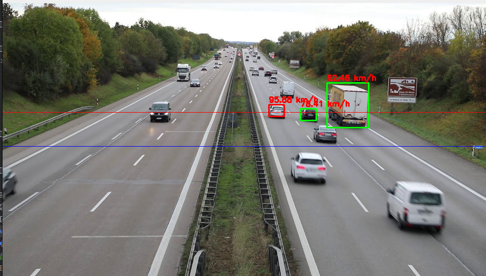
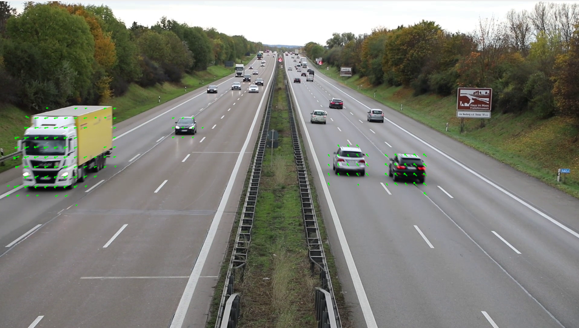

# Tutor simulator

This project integrates optical flow, homography, and the SORT (Simple Online and Realtime Tracking) algorithm with object detection models, such as YOLOv8, to enable efficient object tracking, speed estimation, and direction detection across video frames. The use of optical flow is key to detecting whether vehicles travel upwards or downwards, while homography is utilized for mapping real-world coordinates to image coordinates.

## Features
- **Object Detection**: Detect objects in video frames using YOLOv8.
- **Object Tracking**: Assign unique IDs to objects and track them across frames using the SORT algorithm.
- **Optical Flow Analysis**: Determine whether vehicles are traveling upwards or downwards using motion analysis.
- **Homography for Coordinate Mapping**: Map real-world coordinates to the image plane for precise calculations.

---

## Requirements

### Prerequisites
Ensure you have the following installed on your system:
- Python 3.8 or later
- OpenCV
- NumPy
- A cloned version of the SORT repository

### Repository Setup
You need to clone the SORT repository to use the tracker in this project:

```bash
# Clone the SORT repository
git clone https://github.com/abewley/sort.git

# Navigate to the cloned repository
cd sort
```

Once cloned, you can integrate `sort.py` into your project or use it as a module by appending its path.

---

## Installation

1. **Install Dependencies**:
   Install the required Python libraries:
   ```bash
   pip install numpy opencv-python ultralytics
   ```

2. **Verify SORT Integration**:
   Ensure that the cloned SORT repository is accessible in your project. You can manually add its path to your Python environment:
   ```python
   import sys
   sys.path.append("/path/to/sort")
   from sort import Sort
   ```

---

## Screenshots

### Object tracking + speed estimation (and fine for transgressor :( )


### Optical flow detection

---

## License
This project uses the SORT repository under its respective license. Refer to the [SORT repository](https://github.com/abewley/sort) for license details.

---

## Credits
- **SORT Algorithm**: Developed by Alex Bewley ([GitHub Repository](https://github.com/abewley/sort))
- **YOLOv8**: Developed by Ultralytics ([GitHub Repository](https://github.com/ultralytics/ultralytics))

